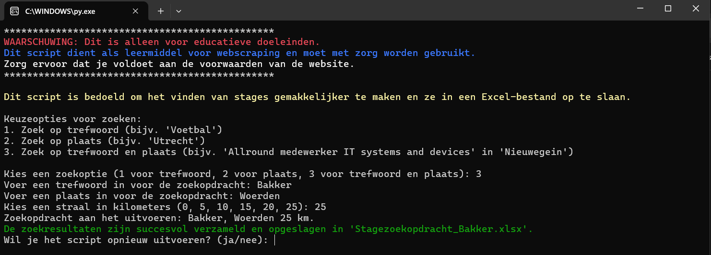

# StageScouter
Stagescouter maakt gebruik van webscraping om vacatures van de website stagemarkt.nl te verzamelen en slaat de zoekresultaten op in een Excel-bestand. Je kunt zoeken op basis van een trefwoord, plaats of een combinatie van beide.

## Functionaliteiten:
- Zoek vacatures op basis van een trefwoord (bijv. "Marketing").
- Zoek vacatures op basis van een plaats (bijv. "Apeldoorn").
- Zoek vacatures met zowel een trefwoord als een plaats (bijv. "Software Developer in Alphen aan den Rijn").
- De zoekresultaten worden geëxporteerd naar een gestructureerd Excel-bestand.

## Python libraries
Installeer deze python libraries met pip install.
- requests
- BeautifulSoup
- pandas
- openpyxl

### Disclaimer:
Stagescouter gebruikt webscraping om gegevens van stagemarkt.nl te verzamelen. Het is van essentieel belang om de gebruiksvoorwaarden van de website altijd te respecteren en de tool op een verantwoorde manier te gebruiken. Het gebruik van Stagescouter voor commerciële doeleinden kan de regels van de website schenden. De ontwikkelaar is niet aansprakelijk voor misbruik of voor juridische gevolgen die hierdoor kunnen ontstaan. Stagescouter is bedoeld voor educatieve doeleinden en dient met respect voor de website-eigenaren te worden gebruikt.

